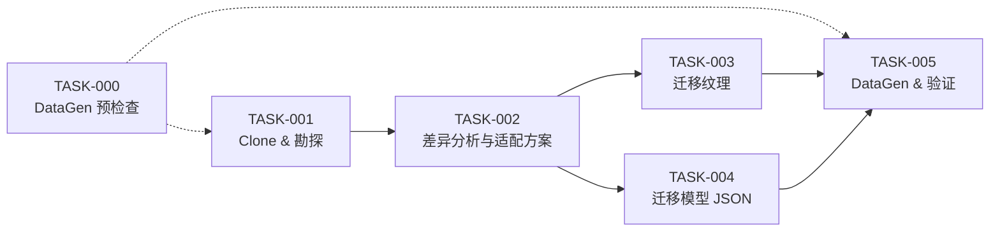

## 计划元数据

- 计划ID: `engine_model_migration`
- 草稿路径: `plans/.draft_plan_engine_model_migration.md`
- 版本状态: `已修订`
- 触发原因: `审查修订`
- 建议下一步: `委托审查`
- 审查修订记录: 2026-05-14 依猫娘审查官-艾琳审查意见修订，涵盖：SSH 前置验证、分支 A/B 决策标准、纹理映射表强制输出、路径修正、DataGen 预检查、范围澄清、回退补充

## 草稿正文

# 计划：引擎模型迁移——从旧项目 TechnicalEngineering3-1.18.2 迁移 4 引擎模型到 TE4 数据生成

## 概述

**目标**：将旧项目 TechnicalEngineering3-1.18.2 中 4 个引擎的独特模型文件迁移到 TE4（NeoForge 1.21.1），替代当前 TE4 中基于 `minecraft:block/cube` 的简单方块模型注册，使每个引擎拥有独立的模型外观（含 idle / active 动画切换）。

**范围**：
- ✅ 4 个引擎的模型迁移：`engine_extraction`、`engine_metal`、`engine_biomass`、`engine_solar`
- ✅ 模型 JSON 文件迁移与适配（block 模型 + item 模型，idle + active 状态）
- ✅ 纹理文件迁移（PNG + .mcmeta 动画元数据）
- ✅ 适配到 TE4 数据生成体系（`TENModels.java` 或资源文件直接落盘）
- ✅ blockstate 变体兼容（水平 facing 旋转 + active 切换）
- ❌ 不涉及其他机器/方块
- ⚠ DataGen 代码修改（`TENModels.java`）在范围内；运行时功能逻辑代码（Block、BlockEntity、Container、Recipe 等）不在范围内
- ❌ 不涉及 GUI 纹理（`textures/machine/engine/` 和 `textures/gui/` 已存在，不修改）
- ❌ 不涉及方块注册逻辑、BlockEntity 逻辑或容器逻辑

**前置约束**：
- TE4 使用 Registrate 注册系统，DataGen 输出到 `src/generated/resources/`
- 旧项目使用 Forge 1.18.2，模型格式（`block/orientable` 变体、`minecraft:block/cube` 变体）基本兼容 1.21.1
- 纹理路径映射需做命名适配（旧项目可能使用不同 mod id 或路径惯例）
- **SSH 远程仓库访问**：TASK-001 执行前必须先验证 SSH 连通性（`ssh -T git@github.com`）；若 SSH 不通，改用 HTTPS clone（`git clone https://github.com/cm6744/TechnicalEngineering3-1.18.2.git`）

---

## 任务清单

### TASK-000: DataGen 预检查

- task_id: `TASK-DATAGEN-CHECK`
- scope: TE4 项目 DataGen 任务配置 + 运行日志
- DoD: DataGen 任务名称已确认，当前 `main` 分支运行 DataGen 能正常通过、无资源错误
- 目标: 确认 DataGen 基础设施可用，为 TASK-005 的验证步骤提供基线——确保迁移前和迁移后的 DataGen 产出差异仅来自本次改动
- 输入: TE4 项目 gradle 配置（`build.gradle` / `dependencies.gradle`）
- 输出:
  - DataGen task 名称（如 `runData` 或 `runClientData` 等）
  - DataGen 运行日志（基线输出）
  - `src/generated/resources/` 目录 git 状态快照（`git status` 确认无脏改动）
- 依赖: 无
- 验收要点:
  - 确认 DataGen gradle task 已注册且可执行
  - 执行 DataGen 无编译错误、无运行异常
  - `git status` 确认工作区干净（或仅预期内未追踪文件）
  - 记录 DataGen task 的具体命令行（如 `.\gradlew runData`），供 TASK-005 复用

### TASK-001: Clone 并勘探旧项目 TechnicalEngineering3-1.18.2

- task_id: `TASK-CLONE-EXPLORE`
- scope: 远程仓库 `git@github.com:cm6744/TechnicalEngineering3-1.18.2.git`
- DoD: 旧项目已 clone 到本地，4 个引擎的模型 JSON、纹理 PNG、blockstate JSON 的内容已知，并输出勘探报告
- 目标: 获取旧项目中 4 个引擎的完整模型资源集（模型 JSON、纹理、blockstate 定义）
- 输入: `git@github.com:cm6744/TechnicalEngineering3-1.18.2.git`
- 输出:
  - 引擎模型 JSON 文件（每引擎 idle + active，约 8 个文件）
  - 引擎纹理 PNG 文件（含 .mcmeta，每引擎 ~3-5 个纹理）
  - blockstate JSON 文件（每个引擎 1 个）
  - 勘探结论文档（记录路径映射关系和适配要点）
- 依赖: 无
- 前置检查:
  - 验证 SSH 连通性：`ssh -T git@github.com`（若失败则改用 HTTPS clone：`git clone https://github.com/cm6744/TechnicalEngineering3-1.18.2.git`）
  - 若远程仓库不可访问（已删除/权限不足），标记为阻塞风险并通知用户
- 验收要点:
  - 旧项目已成功 clone 到本地临时目录（如 `%TEMP%/te3-models/`）
  - 已识别 4 个引擎的模型文件路径与内容
  - 已识别 4 个引擎的纹理文件与 .mcmeta
  - 已识别 blockstate 定义中的 facing/active 切换逻辑
  - 已对比旧项目 vs TE4 的命名差异（mod id、纹理目录结构、模型 parent 差异）
  - 输出一份文字勘测报告，供 TASK-002 使用

### TASK-002: 分析模型差异与适配方案

- task_id: `TASK-DIFF-ANALYSIS`
- scope: 旧项目模型资源 ↔ TE4 当前 `TENModels.java`、`TENBlocks.java` 的模型注册逻辑
- DoD: 输出明确的适配方案文档（含分支 A/B 决策结论 + 纹理迁移映射表），可据此直接执行 TASK-003 和 TASK-004
- 目标: 确定从旧项目到 TE4 的每项资源改如何适配，以及是沿用 DataGen 生成还是直接复制资源文件
- 输入: TASK-001 的勘探报告 + TE4 当前 `TENModels.java` / `TENBlocks.java`
- 输出:
  - **适配方案文档**（记录以下决策）：
    - 模型 JSON 是否需要修改 parent / textures 路径
    - 纹理文件是否需要重命名或转换格式
    - `TENModels.java` 是否新增 `engine()` 数据生成方法，还是直接放静态资源
    - blockstate 是否沿用现有 Registrate blockstate 生成逻辑（大概率是）
    - item 模型是否沿用现有 `.item().model((ctx, prov) -> prov.blockItem(...))` 模式
  - **纹理迁移映射表**（强制输出，TASK-003 严格按此表执行）：
    - 每一行：`源文件（旧项目路径） → 目标文件（TE4 路径）`
    - 标注操作类型：`覆盖` / `跳过` / `重命名`
    - 以 4 个引擎各自分组，明确每个纹理文件的处置方式
  - **分支 A/B 判定结论**（依据以下判定矩阵）：
- 依赖: TASK-001
- 验收要点:
  - 指出旧项目模型 parent（如 `block/orientable` vs `block/cube`）是否需要替换
  - 给出纹理迁移映射表（旧路径 → TE4 路径），标注每文件操作类型
  - 明确 `TENModels.java` 的改动范围（新增方法 / 修改现有 engine() 方法）
  - 判断是否需要新增模型 JSON 的 DataGen 方法，或者直接落盘为静态资源
  - 评估 blockstate 生成是否无变更
  - **分支 A/B 判定矩阵**（TASK-002 必须按此标准决策）：

    | 条件 | 结论 |
    |------|------|
    | 所有 4 个引擎的旧模型 JSON 仅 parent + textures 不同（无自定义 elements） | **分支 A** — 修改 `TENModels.java`，通过 DataGen 生成新模型 |
    | 任一引擎的旧模型 JSON 含自定义 elements / geometry overrides | **分支 B** — 全部 4 引擎统一走静态资源，不混用 |
    | 任一引擎模型需改写 elements 才能适配 | **统一走分支 B**，全部静态化到 `src/main/resources/` |

### TASK-003: 迁移纹理文件

- task_id: `TASK-MIGRATE-TEXTURES`
- scope: `src/main/resources/assets/kenergyengineering/textures/block/`
- DoD: 旧项目的引擎纹理已按 TASK-002 的纹理迁移映射表严格完成操作，路径正确、.mcmeta 完整、无多余文件
- 目标: 根据 TASK-002 输出的纹理迁移映射表，逐行执行文件操作（覆盖/跳过/重命名），将旧项目的引擎纹理 PNG + .mcmeta 迁移到 TE4 的 `textures/block/` 目录
- 输入: TASK-002 的**纹理迁移映射表**（唯一执行依据，不凭"经验"复制）
- 输出: 迁移后的纹理文件（位于 `src/main/resources/assets/kenergyengineering/textures/block/`）
- 依赖: TASK-002（纹理迁移映射表）
- **关键约束**：严格按纹理迁移映射表执行，不做"所有文件直接复制"；TASK-001 勘探到的文件清单仅作参考，不以勘探清单替代映射表
- 验收要点:
  - 每引擎的 idle 正面纹理按映射表已到位（如 `engine_extraction.png`）
  - 每引擎的 active 正面纹理按映射表已到位（如 `engine_extraction_active.png`）
  - 每引擎的 active 动画 .mcmeta 按映射表已到位（如 `engine_extraction_active.png.mcmeta`）
  - 每引擎的底面纹理按映射表已到位（如 `engine_extraction_bottom.png`）
  - 每引擎的侧面/背面纹理按映射表已到位（取决于旧模型结构）
  - 纹理分辨率与格式与现有 TE4 纹理一致（若不匹配则记录并在 TASK-005 验证中检查）
  - 映射表中标注 `跳过` 的文件未被意外复制
  - 映射表中标注 `重命名` 的文件以目标名落盘，旧名不留

### TASK-004: 迁移模型 JSON 文件

- task_id: `TASK-MIGRATE-MODELS`
- scope: `src/generated/resources/assets/kenergyengineering/models/block/`（分支 A）或 `src/main/resources/assets/kenergyengineering/models/block/`（分支 B）
- DoD: 4 个引擎的 idle + active 模型 JSON 已到位，纹理路径正确，blockstate 引用正确
- 目标: 将旧项目的引擎模型 JSON 适配后放置到 TE4 的正确位置（DataGen 输出落地目录或作为静态资源）
- 输入: TASK-002 的适配方案 + TASK-003 已迁移的纹理
- 输出: 8 个模型 JSON 文件（每引擎 idle + active），内容已适配 TE4 的路径与 parent
- 依赖: TASK-002（适配方案）, TASK-003（纹理基本位）
- 决策分支（由 TASK-002 结论决定）：
  - **分支 A** — 通过 `TENModels.java` DataGen 生成模型：修改 `TENModels.java`，新增或修改 `engine()` / `engineActive()` 方法以生成自定义模型（如 `orientable` 或 `orientable_with_bottom` 变体）
  - **分支 B** — 直接落盘为静态资源：将适配后的模型 JSON 放到 `src/main/resources/assets/kenergyengineering/models/block/`（不放入 `src/generated/resources/`，否则下次 DataGen 运行会覆盖），不修改 `TENModels.java`
- 验收要点:
  - 每个模型 JSON 的 `parent` 正确（如 `kenergyengineering:block/engine_xy` 的自定义父模型，或 `block/orientable`）
  - 每个模型 JSON 的 `textures` 引用路径以 `kenergyengineering:block/...` 开头，且对应纹理已存在
  - idle / active 成对出现，命名约定为 `engine_{type}.json` / `engine_{type}_active.json`
  - blockstate 文件（由 Registrate 自动生成）引用模型名称正确
  - item 模型的 parent 指向 block idle 模型

### TASK-005: 运行 DataGen 并验证

- task_id: `TASK-VALIDATE`
- scope: 运行 DataGen + 检查生成产物（文件级验证，不涉及游戏运行时加载）
- DoD: DataGen 运行无报错，生成的 blockstate 和模型 JSON 文件内容正确，纹理引用路径有效，`build` 无资源错误
- 目标: 端到端文件级验证模型迁移正确性——所有模型 JSON 文件通过格式校验、纹理路径可解析、blockstate 变体引用正确
- 输入: TASK-003 + TASK-004 的产出
- 输出: DataGen 运行日志 + 生成产物检查结论
- 依赖: TASK-000（DataGen task 名称），TASK-003, TASK-004
- 验收要点:
  - 使用 TASK-000 确认的 DataGen task 名称运行（如 `.\gradlew runData`），无编译错误、无运行异常、无资源缺失警告
  - 检查 `src/generated/resources/assets/kenergyengineering/blockstates/engine_*.json` 中的变体引用 — 模型名正确、y 旋转值正确（0/90/180/270）
  - 若为分支 A：检查 DataGen 已生成新模型 JSON；若为分支 B：确认 `src/generated/resources/` 下无冲突覆盖（静态模型已放在 `src/main/resources/` 且被正确识别）
  - 检查 `src/generated/resources/assets/kenergyengineering/models/item/engine_*.json` — parent 正确
  - 所有模型 JSON 中引用的纹理路径以 `kenergyengineering:block/...` 开头，在 `src/main/resources/` 下能对应找到实际文件
  - 运行 `.\gradlew build` 无资源类错误

---

## 风险与回退

| 风险 | 可能性 | 影响 | 缓解措施 | 回退方案 |
|------|--------|------|----------|----------|
| 旧项目模型使用 1.18.2 特有格式/特性，1.21.1 不兼容 | 低 | 模型失效 | TASK-001 先读旧模型 parent 和结构，对照 Minecraft 1.21.1 模型规范确认兼容性 | 将旧模型 JSON 改为使用 `minecraft:block/cube` 变体，保留纹理布局 |
| 旧项目纹理分辨率/格式与 TE4 不一致 | 中 | 渲染异常或性能问题 | TASK-001 检查旧纹理尺寸和格式，TASK-003 迁移时确认一致性 | 保持 TE4 现有纹理不变，仅迁移旧项目的额外侧面纹理 |
| 旧项目 mappings 不同导致纹理路径/模型命名有偏移 | 中 | 模型找不到纹理 | TASK-002 建立纹理路径映射表，逐项核对 | 手动修正路径映射，在模型 JSON 中显式指定所有 texture 引用 |
| DataGen 与静态资源冲突（同路径文件争夺） | 低 | 生成产物被覆盖或 IDE 报错 | TASK-004 分支决策明确选型；若选 DataGen，保证 `src/main/resources/` 下无同名 override | 切到分支 B（纯静态资源），消除 DataGen 的不确定性 |
| 现有 blockstate 变体的 FACING 属性使用 `HorizontalDirection`，旧项目用不同朝向枚举 | 低 | blockstate 旋转错误 | TASK-001 核对旧 blockstate 的旋转值；TE4 的 `HorizontalDirection` 四向已知 | 调整 blockstate 变体的 y 旋转值 |
| 旧项目引擎有特殊模型部件（如活塞杆/旋转叶片），需新增模型元素 | 中 | 模型 JSON 需重写且工作量大 | TASK-001 确认旧模型复杂度，TASK-002 评估是否需要自定义模型或 elements | 简化模型为 `orientable` 变体，丢弃复杂几何元素，优先保证纹理正确 |
| 远程仓库不可访问（已删除/权限不足/SSH 和 HTTPS 均不通） | 低 | TASK-001 完全阻塞，无法获取旧项目模型 | TASK-001 前置检查 SSH 和 HTTPS 两种协议，先 SSH 后 HTTPS 降级 | 联系仓库维护者 cm6744 确认仓库可用性或获取模型文件离线副本 |

**回退总则**：若 TASK-002 发现模型迁移工作量过大或兼容问题不可解，撤销全部文件改动，恢复 TE4 当前 `TENModels.java` 的 `engine()` / `engineActive()` cube 模型注册方式。——**先 commit 或 stash 当前工作，再开始迁移**，确保可干净回退。

---

## 执行顺序总览

**关键路径**：TASK-000 为独立预检查（与后续并行不矛盾），TASK-001 → TASK-002 是前置阻塞依赖，TASK-003 和 TASK-004 可并行执行。TASK-005 为收尾验证。

---

## 附录 A：TE4 当前引擎相关文件索引

| 文件路径 | 说明 |
|----------|------|
| `src/main/java/com/modularmc/ten/common/data/TENModels.java` | DataGen 模型生成（含 `engine()`, `engineActive()`, `machine()`, `machineActive()`） |
| `src/main/java/com/modularmc/ten/common/data/TENBlocks.java` | 方块注册（含 `engine()` 私有方法，定义 blockstate 变体逻辑） |
| `src/generated/resources/assets/kenergyengineering/blockstates/engine_*.json` | 生成的 blockstate（facing + active 8 变体） |
| `src/generated/resources/assets/kenergyengineering/models/block/engine_*.json` | 生成的 block 模型（当前为 cube 格式） |
| `src/generated/resources/assets/kenergyengineering/models/item/engine_*.json` | 生成的 item 模型（parent→block） |
| `src/main/resources/assets/kenergyengineering/textures/block/engine_*.png` | 手绘纹理（含 active .mcmeta 动画） |
